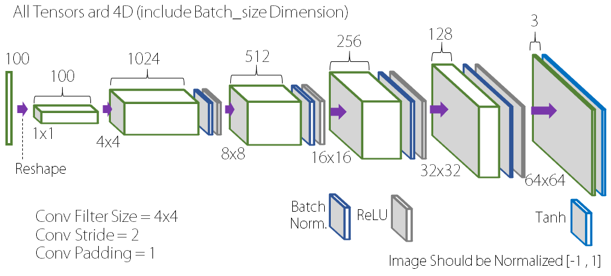
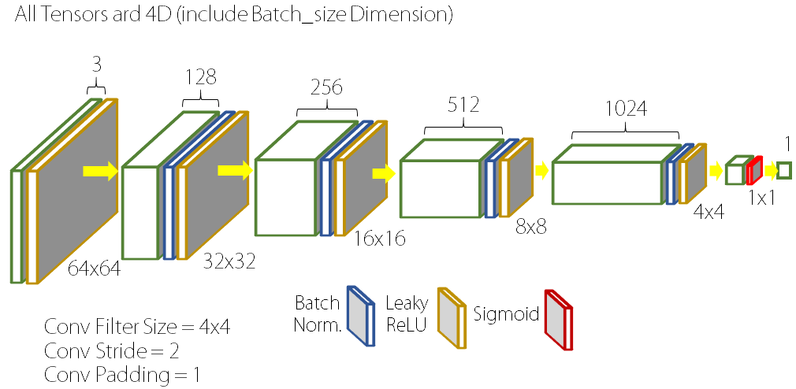
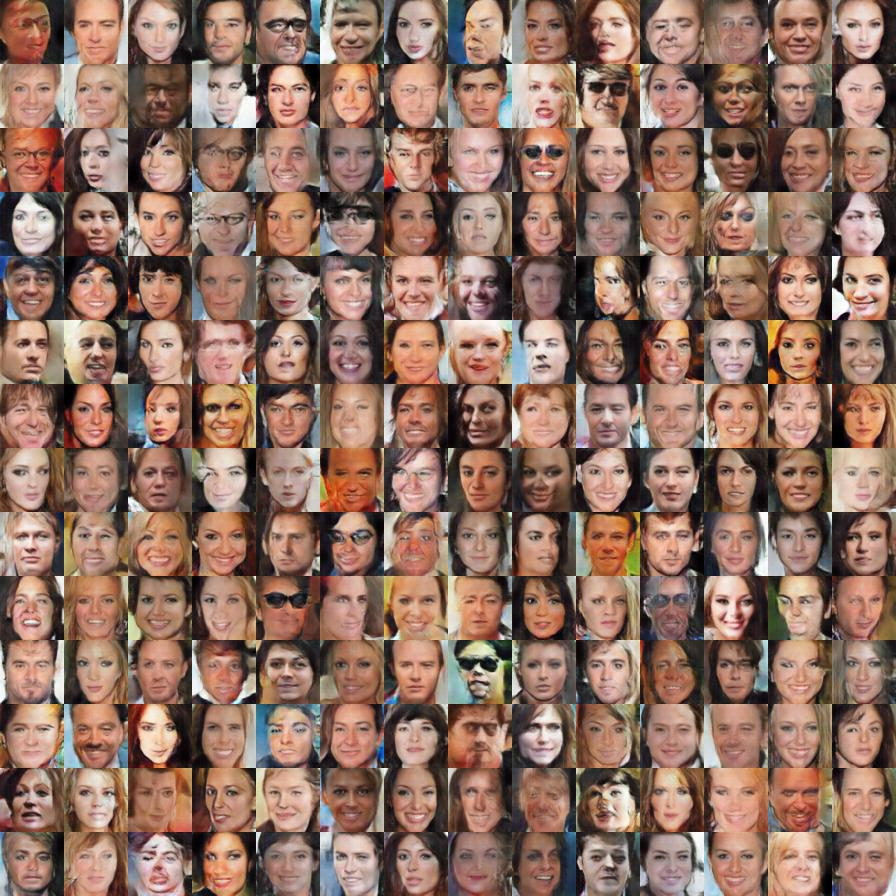
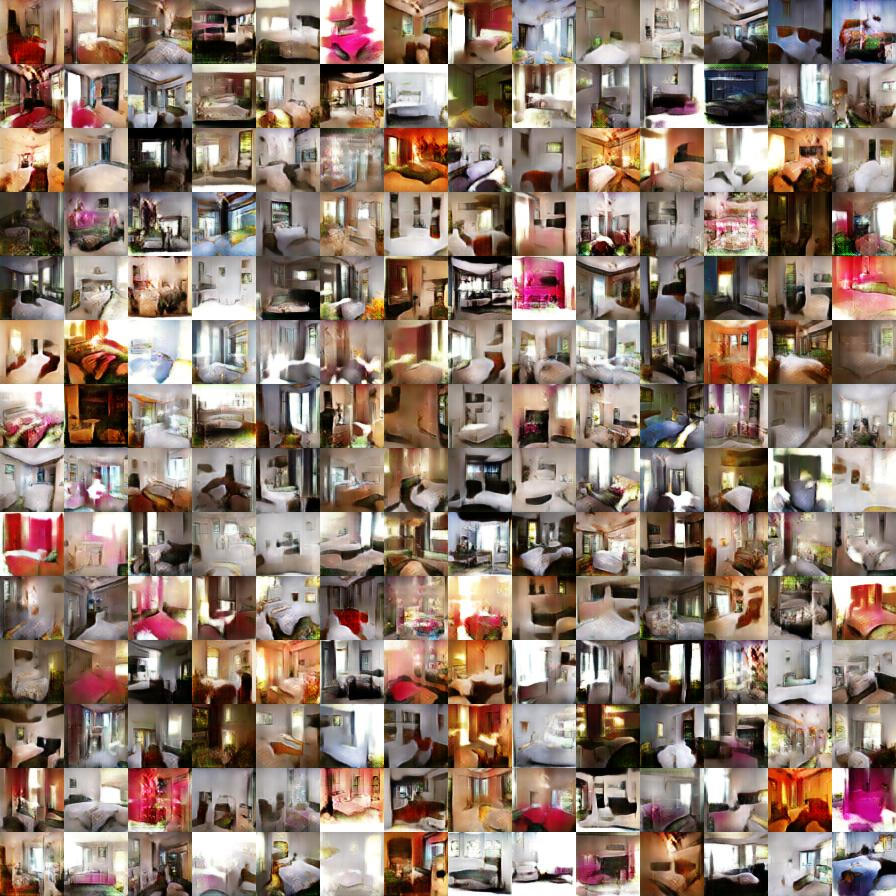

# DCGAN in Tensorflow

Basic Implementation (Study friendly) of DCGAN in Tensorflow

More Information: [Original Paper](https://arxiv.org/abs/1511.06434)

Identical Tensorflow Implemenation is on the [taeoh-kim's Github](https://github.com/taeoh-kim/Pytorch_DCGAN)

## 1. Environments

- Windows 10
- Python 3.5.3 (Anaconda)
- Tensorflow 1.0.0
- Numpy 1.13.1
- lmdb (pip install lmdb): for LSUN Dataset

## 2. Networks and Parameters

### 2.1 Hyper-Parameters

- Image Size = 64x64 (Both in CelebA and LSUN-Bedroom)
- Batch Size = 128 (~32 is OK)
- Learning Rate = 0.0002
- Adam_beta1 = 0.5
- z_dim = 100
- Epoch = 5 in CelebA is Enough, 1 in LSUN is Enough. Sometimes it can be diverge.

### 2.2 Generator Networks (network.py)

<p align="center"></p>

### 2.3 Discriminator Networks (network.py)

<p align="center"></p>

## 3. Run (Train)

You can modify hyper-parameter. Look at the parsing part of the code.

### 3. 1 CelebA DB (Cropped Face, 156253 Samples)

- Database Setting: [link]()

- Train & Test

```bash
python train.py --filelist <filelist_name> --out_dir <output_directory>
```

- Test results will be saved in 'output_directory'

### 3. 2 LSUN-Bedroom DB (3033042 Samples)

- Database Setting: [link]()

- Train & Test

```bash
python train.py --filelist <filelist_name> --out_dir <output_directory>
```

- Test results will be saved in 'output_directory'


## 4. Results

DCGAN with CelebA (5 Epochs)

<p align="center"></p>

DCGAN with LSUN (1 Epochs)

<p align="center"></p>


